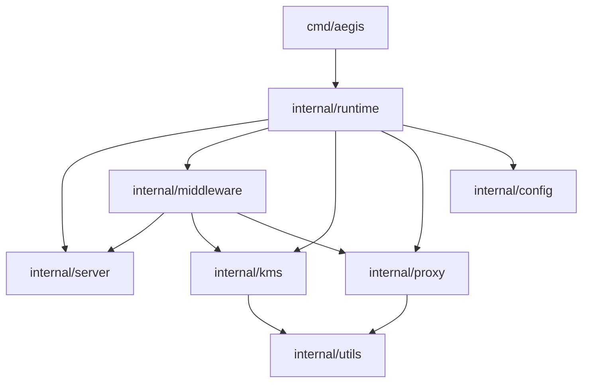

# Aegis Module Boundaries

## Dependency Direction

The server microkernel must stay stable. Concrete policy modules depend on it, and runtime composes them. The server package must not import `internal/middleware`, otherwise the pipeline becomes tightly coupled and harder to test.

## Module Contracts

### `internal/runtime`

Responsibility: assemble a configured Aegis server from stable module interfaces.

Exports:
- `NewServer(cfg *config.Config, logger *slog.Logger) (*server.Server, error)`
  - Purpose: build middleware in ADR-004 order and return a runnable server.
  - Errors: missing signing key, invalid KMS config, invalid provider config.
  - Invariant: all provider egress hosts are allowlisted before proxy middleware is created.

### `internal/server`

Responsibility: execute HTTP requests through an ordered middleware pipeline.

Exports:
- `New(cfg *config.Config, logger *slog.Logger, opts ...Option) (*Server, error)`
- `WithMiddleware(m Middleware) Option`
- `RequestContext`

Internal:
- HTTP mux registration.
- Recovery, request ID, and audit metadata middleware.
- The main gateway currently mounts only `/v1/*` and `/health`.

### `internal/middleware`

Responsibility: enforce request policy and transform request context before proxying.

Exports:
- `Auth`, `RateLimiter`, `PIIRedaction`, `Router`, `KMSInjector`, `Adapter`, `Proxy`

Invariants:
- Auth runs before any body scanning or KMS access.
- Router validates model permission before KMS key resolution.
- KMS key resolution fails closed when provider or BYOK key IDs are absent.
- Adapter may rewrite request body and target path, but must not log body content.

### `internal/proxy`

Responsibility: safely forward requests to an upstream provider.

Exports:
- `NewEngine(cfg StreamConfig) *Engine`
- `ProxyRequest(...) (*ProxyResult, error)`

Invariants:
- Egress host must pass allowlist validation.
- Request and response bodies are streamed, not logged.
- Hop-by-hop and client credential headers are stripped before upstream forwarding.

## Change Scenarios

| Scenario | Expected modules touched | Boundary verdict |
| --- | --- | --- |
| Add a Redis limiter | `internal/middleware/ratelimit.go`, runtime config mapping | Isolated |
| Add RS256 virtual keys | `internal/middleware/auth.go`, config, tests | Isolated if auth interface stays stable |
| Add Anthropic request conversion | `internal/middleware/adapter.go`, adapter tests | Isolated |
| Move local KMS file blobs to another durable backend | `internal/kms/local`, runtime backend wiring | Isolated |
| Change middleware order | ADR, `internal/runtime`, order tests | Requires architecture review |
| Add quota enforcement | `internal/quota`, new middleware, runtime config mapping, durable store | Requires architecture review because it changes request rejection semantics |
| Mount Admin API | `internal/admin`, `cmd/aegis` or runtime listener wiring, auth/audit config | Requires architecture review because it adds a new trust boundary |
