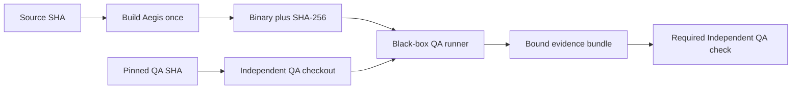

# Independent QA Baseline Design

## Status

Approved for implementation on 2026-07-16. The user selected the multi-agent
team's strict recommendation: a separately versioned QA repository that treats
the built Aegis artifact as the system under test.

## Goal

Create an independent, security-first test product for AegisLLM whose tests,
oracles, workflow, and evidence are isolated from production source code and
whose result can be made a required merge gate.

The framework must answer four different questions without conflating them:

1. Did the developer-owned white-box tests pass?
2. Did the exact built binary satisfy the public and operator contracts?
3. Which immutable source, QA, and artifact revisions produced the result?
4. Was the QA baseline changed under independent review rather than in the
   source change that it evaluates?

## Current Baseline

- The source repository contains 25 same-package `*_test.go` files. They are
  valuable developer regression tests but are not an independent oracle.
- A fresh `GOTOOLCHAIN=go1.26.5 go test -count=1 -coverprofile=... ./...` run
  passes at 72.4% statement coverage.
- The source CI runs Go 1.22 compatibility, release preflight, and Docker smoke
  jobs, but has no independent QA job or coverage ratchet.
- `main` currently has no branch protection, ruleset, or `CODEOWNERS`.
- The current process and container smoke tests do not prove an authenticated
  provider `200` path against the exact final artifact.

The 72.4% figure is a characterization baseline, not a release-quality target.
Unsupported scaffolds such as Vault and quota are required to fail closed; they
must not be counted as supported merely to improve coverage.

## Architecture

### Repository boundary

`yknothing/AegisLLM-QA` is a separate public repository. Public visibility is
intentional: the source repository is public, the tests contain synthetic data
only, and test secrecy is not a security control. The separate repository gives
the QA suite its own history, permissions, reviews, release tags, and commit SHA.

The QA repository is a standalone Go module with no dependency on
`github.com/yknothing/AegisLLM`. It must not import Aegis packages, inspect Go
source, or invoke unexported implementation. Its only SUT interfaces are:

- an exact prebuilt `aegis` binary;
- its CLI, filesystem effects, stdout, and stderr;
- its HTTP surface;
- a hermetic TLS fake-provider boundary;
- an optional, separately gated container artifact.

Existing source-repository tests remain in place. Moving them would either
destroy useful white-box coverage or force Aegis to expose internal APIs solely
for tests.

### QA module layout

```text
AegisLLM-QA/
  .github/
    CODEOWNERS
    workflows/ci.yml
  cmd/aegis-qa/main.go
  internal/
    artifact/identity.go
    evidence/report.go
    harness/process.go
    harness/provider.go
    harness/workspace.go
    suite/cases.go
    suite/contract.go
    suite/security.go
    suite/operator.go
    suite/unsupported.go
  testdata/
    README.md
  BASELINE.md
  GOVERNANCE.md
  README.md
  go.mod
```

All production-like secrets are unique synthetic canaries generated per run.
The module uses the Go standard library only so that the independent framework
does not expand the project's dependency or supply-chain surface.

### Execution and evidence flow

The source workflow performs these steps in order:

1. Checkout the candidate source SHA.
2. Build the Aegis binary once with the full source SHA embedded in build
   metadata.
3. Compute the binary SHA-256.
4. Checkout the immutable QA SHA named in `qa-baseline.lock`.
5. Verify the checked-out QA commit equals the lock.
6. Run the QA module's own unit tests.
7. Run the QA CLI against the already-built binary; rebuilding Aegis inside the
   QA suite is forbidden.
8. Upload a non-secret evidence bundle containing the source SHA, QA SHA,
   binary SHA-256, toolchain, platform, case results, and explicit gaps.

The QA runner fails closed when any identity input is absent or inconsistent.
It never reports `pass` if a required case was skipped or the evidence file
cannot be written.



## Initial Required Test Baseline

### Artifact identity

- The binary exists, is executable, and its SHA-256 matches the workflow input.
- `aegis --version` contains the exact full source SHA.
- The evidence records the actual Go runtime, OS, architecture, source SHA, QA
  SHA, and binary digest.

### Operator and lifecycle contract

- `operator revocation init` creates an owner-only state file.
- `operator provider-key import` accepts the provider key only via stdin and
  does not emit it.
- `operator virtual-key issue` writes a new owner-only file and refuses an
  existing path.
- `operator virtual-key revoke` changes a live token from accepted to rejected
  within a bounded poll deadline.

### HTTP and security-order contract

- Only the documented health and chat-completions routes are reachable.
- An unauthenticated request returns `401` and produces zero fake-provider hits.
- A valid token and supported model traverse a hermetic TLS provider and return
  its synthetic `200` response.
- A revoked token returns `401` and produces no additional provider hit.
- Provider and client hop-by-hop credentials do not cross the wrong boundary.
- Unsupported routes, methods, providers, Vault, Redis, quota, TPM, BYOK, and
  reserved adapters fail closed rather than silently degrading.

### Confidentiality oracle

The runner injects distinct synthetic canaries for provider key, virtual key,
prompt, completion, and error text. It scans gateway stdout/stderr, temporary
state, client error bodies, and the evidence bundle.

Expected appearances are explicitly bounded: the provider key may appear only
in the fake provider's in-memory Authorization capture; the prompt only in its
in-memory request capture; the completion only in the client success response;
the virtual key only in the client Authorization input. No canary may appear in
gateway logs or the persisted evidence bundle.

## Test Data and Isolation

- Every case gets a fresh `os.MkdirTemp` workspace and an ephemeral loopback
  port.
- No production configuration, data, credentials, DNS, or provider endpoint is
  read.
- The fake provider uses TLS and a per-run certificate trust file.
- Polling is deadline-based and records the last observed state; fixed sleeps
  are not the sole synchronization mechanism.
- Cleanup kills child processes and deletes temporary state even after failure.
- Evidence contains hashes and classifications, never raw prompts, completions,
  bearer tokens, provider keys, or captured traffic.

## Governance

### Change ownership

- Source developers may propose QA changes but cannot merge them without the
  independent QA reviewer required by the QA repository ruleset.
- The QA repository protects `main`, `.github/**`, `GOVERNANCE.md`, the evidence
  schema, and all test/oracle files through `CODEOWNERS` plus a required-review
  ruleset.
- The source repository protects `qa-baseline.lock`, the independent QA
  workflow, and `CODEOWNERS` under the same review policy.
- Stale approvals are dismissed, the latest push requires approval, force-push
  and deletion are blocked, and no routine bypass actor is configured.
- A source PR cannot update the production code and QA oracle atomically. A
  baseline change lands in the QA repository first, then a separate governed
  source PR advances `qa-baseline.lock`.

The repositories are currently owned by a personal GitHub account and no real
independent QA username or organization team has been supplied. The technical
isolation and locked rulesets can be installed now, but final human ACL
assignment cannot be truthfully claimed until those identities are added with
the intended role. Until then, rules requiring an independent approval may
intentionally block baseline changes rather than permit an owner-only
self-approval path.

### Waivers and quarantine

- Required P0 cases cannot be skipped or quarantined.
- A P1/P2 quarantine entry requires an issue, owner, reason, expiry no later
  than seven days, and a non-release nightly lane. The initial baseline contains
  no quarantine mechanism because no initial required case is optional.
- A vulnerability database outage is `not_run`, never `no vulnerabilities`.
- Evidence retention is at least 30 days in CI; release evidence is retained
  with the release record.

## CI Policy

- Pull requests run QA unit tests and the independent black-box baseline once.
- The required black-box job uses the pinned Go release toolchain and a fixed QA
  commit.
- Nightly repetition, race/shuffle, fuzz, mutation, performance, container, and
  platform matrices are follow-on lanes. They must not be reported as present
  in the first baseline unless implemented and evidenced.
- Existing source `go test`, race, lint, `gosec`, source/binary `govulncheck`,
  and Docker smoke gates remain required; independent QA complements rather
  than replaces them.

## Acceptance Criteria

The first baseline is accepted only when all of the following are true:

1. `AegisLLM-QA` exists as an independent repository and standalone Go module
   with no import or filesystem dependency on Aegis source.
2. Its framework unit tests pass with race detection and randomized order.
3. The QA runner passes the artifact, operator, authenticated provider `200`,
   unauthenticated no-egress, revocation, fail-closed, and confidentiality cases
   against one exact locally built binary.
4. The evidence schema and report bind the source SHA, QA SHA, and artifact
   digest, and a verifier rejects a mismatch.
5. The source repository pins the QA commit and runs it in a distinct
   `Independent QA` workflow without rebuilding the SUT.
6. Both repositories contain governance documentation and protected change
   surfaces; installed GitHub protection is verified through API output.
7. Existing source tests, race checks, vet, formatting/diff checks, and relevant
   security gates still pass.
8. An adversarial reviewer confirms that no test imports Aegis source, no
   secret canary is persisted, no required case silently skips, and source/QA
   revisions cannot drift inside one result.
9. Unavailable human QA identities and any platform or performance lanes not
   implemented are reported as explicit residual gaps, not implied green.

## Rollback

- Reverting the source workflow and `qa-baseline.lock` removes the source-repo
  integration without changing Aegis runtime behavior.
- The QA repository remains an auditable test history and can be archived.
- Rulesets are exported before mutation. If a rule blocks emergency recovery,
  the repository owner may temporarily disable it only with a recorded reason
  and must restore it after recovery; the event is not a passing QA result.

## Non-goals

- Refactoring production code or exposing internal APIs for testing.
- Claiming Vault, quota, Redis, BYOK, RS256, multi-host revocation, or reserved
  provider adapters are implemented.
- Calling real provider APIs or handling production credentials.
- Replacing source-unit coverage with black-box coverage percentages.
- Completing production performance, chaos, cross-platform, mutation, and fuzz
  programs in the initial baseline.
