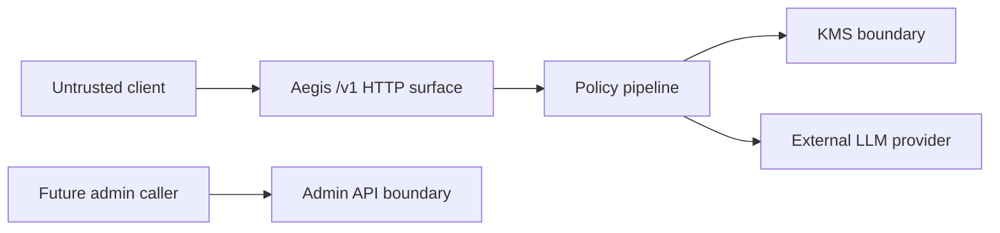

# Aegis Threat Model

## Assets

| Asset | Sensitivity | Owner |
| --- | --- | --- |
| Provider API keys | Critical secret | KMS |
| Virtual key signing material | Critical secret | Auth/runtime |
| Client prompts and completions | Sensitive user data | Request pipeline/proxy only |
| Usage and cost metadata | Operational data | Quota/audit |
| Provider allowlist and routing config | Security policy | Config/runtime |

## Trust Boundaries

## Abuse Paths and Controls

| Boundary | Abuse Path | Required Control |
| --- | --- | --- |
| Client to `POST /v1/chat/completions` | Missing, forged, expired, or replayed virtual key | Exact method/path dispatch plus JWT signature, non-empty issuer, expiry, explicit key source, and revocation checks before body processing |
| Client body to provider | Oversized prompt, retained body copies, or PII leakage | One bounded request-scoped buffer, zero superseded/final buffers, configurable PII mode, no body logging |
| Router to KMS | User asks for an unauthorized model to reach a different provider key | Model permission check before provider and key selection |
| KMS to request context | Provider key remains in memory after request | `SecureBytes.Close()` at KMS, proxy, and pipeline cleanup boundaries |
| Gateway to provider | SSRF or exfiltration via malicious URL | Parse URL and validate normalized host against exact/wildcard allowlist; fail closed |
| Logs and errors | Secret or content disclosure | Safe audit logger, metadata-only audit fields, generic client-facing errors |
| Config to runtime | Misspelled security field silently disables a control | Strict JSON decoding at root and nested custom-unmarshal boundaries; unknown fields fail startup |
| Gateway failure to provider health | Local KMS/adapter/policy 5xx opens a provider circuit | Only proxy-observed provider 429/5xx outcomes count as provider failures |
| Future admin API | BYOK key submission or deletion by unauthorized caller | Separate listener or mTLS, admin token comparison, request size limits, audit metadata |

## Residual Risks

- Go strings used for HTTP headers can retain provider keys until garbage collection. The runtime must minimize lifetime and avoid additional copies, but cannot guarantee immediate zeroing of header strings.
- Local KMS zeroes Store-owned key byte slices on Close, but Go AES/GCM internals may retain key schedule material that Aegis cannot explicitly zero.
- The egress allowlist constrains normal proxy execution to configured provider hosts. Exact entries do not imply subdomains; `*.` wildcard entries allow nested subdomains but not the apex. The allowlist is not a containment boundary for a fully compromised process or malicious configuration.
- Local in-memory KMS backend is for smoke tests and development. File-backed local KMS persists encrypted blobs for standalone validation, while Vault-grade operational controls remain future work.
- HS256 JWT validation is the minimal no-dependency baseline. RS256 requires a separate reviewed key loading and rotation design.
- Provider-specific protocol adapters are framework-level only until each adapter has contract tests against real provider formats.
- Redis, Vault, quota, and TPM controls are not fully runtime-enforced yet. Configuration enabling Redis/Vault modes, reserved Redis/Vault config fields, quota, reserved quota storage/budget fields, reserved store config, or non-zero TPM is rejected so deployments cannot silently assume those controls are active.
- Virtual-key revocation is durable on one host: a serialized atomic snapshot is polled into immutable request-path state. Missing, corrupted, or permission-unsafe state fails closed; a running reader also rejects a lower generation or same-generation content change. A valid older snapshot restored before restart is not detectable without an independent trusted monotonic anchor, so recovery must preserve the union of unexpired tombstones. Multi-host/shared revocation remains unimplemented.
- The offline Operator CLI provisions configured provider keys, issues pool virtual keys, revokes their `kid`, and migrates legacy KMS blobs. Provider keys are bounded non-terminal stdin only; token output requires explicit owner-only file or stdout. No privileged operation is mounted on the public data plane.
- KMS v2 ciphertext authenticates its exact key ID as AAD. Legacy blobs remain swap-vulnerable only while the explicit version-1 migration mode is enabled; after migration, `minimum_envelope_version=2` rejects restored legacy blobs. Rollback to an older binary requires restoring the pre-migration encrypted backup.

## Security Review Gates

- No code path may proxy before auth, model authorization, KMS resolution, and egress validation succeed.
- Empty egress allowlist is a configuration error.
- Unknown configuration fields and an empty auth issuer are startup errors.
- Any new log field must be reviewed as metadata-only.
- Any new dependency must have a security review before merge.
- Any configuration field that enables an unimplemented security or cost-control capability must fail fast rather than silently falling back.
