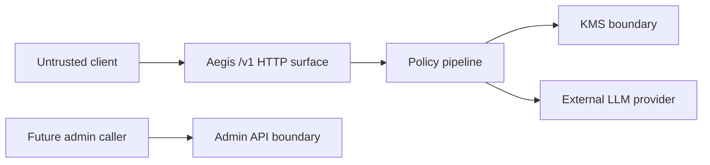

# Aegis Threat Model

## Assets

| Asset | Sensitivity | Owner |
| --- | --- | --- |
| Provider API keys | Critical secret | KMS |
| Virtual key signing material | Critical secret | Auth/runtime |
| Client prompts and completions | Sensitive user data | Request pipeline/proxy only |
| Usage and cost metadata | Operational data | Quota/audit |
| Provider allowlist and routing config | Security policy | Config/runtime |

## Trust Boundaries

## Abuse Paths and Controls

| Boundary | Abuse Path | Required Control |
| --- | --- | --- |
| Client to `/v1/*` | Missing, forged, expired, or replayed virtual key | JWT signature, issuer, expiry, and revocation checks before body processing |
| Client body to provider | Oversized prompt or PII leakage | Bounded body reads, configurable PII mode, no body logging |
| Router to KMS | User asks for an unauthorized model to reach a different provider key | Model permission check before provider and key selection |
| KMS to request context | Provider key remains in memory after request | `SecureBytes.Close()` at KMS, proxy, and pipeline cleanup boundaries |
| Gateway to provider | SSRF or exfiltration via malicious URL | Parse URL and validate normalized host against allowlist; fail closed |
| Logs and errors | Secret or content disclosure | Safe audit logger, metadata-only audit fields, generic client-facing errors |
| Future admin API | BYOK key submission or deletion by unauthorized caller | Separate listener or mTLS, admin token comparison, request size limits, audit metadata |

## Residual Risks

- Go strings used for HTTP headers can retain provider keys until garbage collection. The runtime must minimize lifetime and avoid additional copies, but cannot guarantee immediate zeroing of header strings.
- Local in-memory KMS backend is an MVP/development storage backend. A persistent encrypted backend or Vault integration is required before production use.
- HS256 JWT validation is the minimal no-dependency baseline. RS256 requires a separate reviewed key loading and rotation design.
- Provider-specific protocol adapters are framework-level only until each adapter has contract tests against real provider formats.

## Security Review Gates

- No code path may proxy before auth, model authorization, KMS resolution, and egress validation succeed.
- Empty egress allowlist is a configuration error.
- Any new log field must be reviewed as metadata-only.
- Any new dependency must have a security review before merge.
