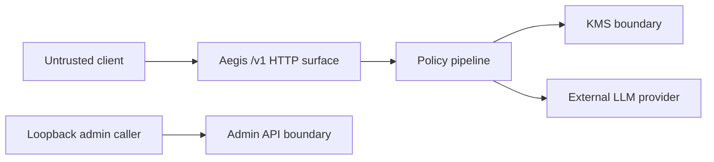

# Aegis Threat Model

## Assets

| Asset | Sensitivity | Owner |
| --- | --- | --- |
| Provider API keys | Critical secret | KMS |
| Virtual key signing material | Critical secret | Auth/runtime |
| Client prompts and completions | Sensitive user data | Request pipeline/proxy only |
| Usage and cost metadata | Operational data | Quota/audit |
| Provider allowlist and routing config | Security policy | Config/runtime |

## Trust Boundaries

```mermaid
flowchart LR
  Client["Untrusted client"] --> Ingress["Aegis /v1 HTTP surface"]
  Ingress --> Pipeline["Policy pipeline"]
  Pipeline --> KMS["KMS boundary"]
  Pipeline --> Provider["External LLM provider"]
  Admin["Loopback admin caller"] --> AdminAPI["Admin API boundary"]
```

## Abuse Paths and Controls

| Boundary | Abuse Path | Required Control |
| --- | --- | --- |
| Client to `POST /v1/chat/completions` | Missing, forged, expired, or replayed virtual key | Exact method/path dispatch plus JWT signature, non-empty issuer, expiry, explicit key source, and revocation checks before body processing |
| Client body to provider | Oversized/complex JSON, retained body copies, escaped or split PII, or parser ambiguity | Own the transport body once; apply tighter semantic byte/string/content-array/depth/value/member/match budgets; canonicalize supported JSON, reject duplicate/ambiguous fields and non-redactable PII positions, aggregate text parts within one message, zero owned superseded/final buffers, and never log bodies |
| Router to KMS | User asks for an unauthorized model to reach a different provider key | Model permission check before provider and key selection |
| KMS to request context | Provider key remains in memory after request | `SecureBytes.Close()` at KMS, proxy, and pipeline cleanup boundaries |
| Gateway to provider | SSRF, DNS rebinding, or exfiltration via malicious URL/port/address | Strictly bind HTTPS host+port to an exact/wildcard allowlist, reject any non-public DNS answer, and dial only the validated IP; fail closed |
| Logs and errors | Secret or content disclosure | Safe audit logger, metadata-only audit fields, generic client-facing errors |
| Config to runtime | Misspelled security field silently disables a control | Strict JSON decoding at root and nested custom-unmarshal boundaries; unknown fields fail startup |
| Gateway failure to provider health | Local KMS/adapter/policy 5xx opens a provider circuit | Only proxy-observed provider 429/5xx outcomes count as provider failures |
| Loopback Admin API | Stolen `X-Admin-Token`, non-loopback bind, or BYOK key submission | Bind loopback only; constant-time token compare; request size limits; BYOK remains 501; never log issued JWTs |

## Residual Risks

- Go strings used for HTTP headers can retain provider keys until garbage collection. The runtime must minimize lifetime and avoid additional copies, but cannot guarantee immediate zeroing of header strings.
- Local KMS zeroes Store-owned key byte slices on Close, but Go AES/GCM internals may retain key schedule material that Aegis cannot explicitly zero.
- The egress allowlist constrains normal proxy execution to configured HTTPS endpoints. Host-only and `*.` wildcard rules authorize port 443; wildcards allow nested subdomains but not the apex. Non-default ports require exact host+port entries. DNS names fail closed if any answer is private or special-use and connect only through a validated address. Explicit IP literals require an exact IP+port rule for deliberately configured hermetic endpoints. The allowlist is not a containment boundary for a fully compromised process or malicious configuration.
- The local in-memory KMS backend is available only through explicit programmatic test injection. Binary-loaded configuration requires the file-backed local KMS, which persists encrypted blobs for standalone validation; Vault-grade operational controls remain future work.
- HS256 JWT validation is the minimal no-dependency baseline. RS256 requires a separate reviewed key loading and rotation design.
- Provider-specific protocol adapters are framework-level only until each adapter has contract tests against real provider formats.
- PII protection is bounded lexical DLP for the currently supported `messages[].content` schema. It does not prove that a model cannot infer sensitive data from separately meaningful messages or non-text media, and new provider schemas require their own reviewed semantic aggregation rules. Configuration and runtime share the same 4 MiB outer request ceiling; requests beyond it fail with `413`.
- Redis, Vault, quota, and TPM controls are not fully runtime-enforced yet. Configuration enabling Redis/Vault modes, reserved Redis/Vault config fields, quota, reserved quota storage/budget fields, reserved store config, or non-zero TPM is rejected so deployments cannot silently assume those controls are active.
- The in-process limiter enforces RPM and concurrency independently per authenticated virtual key. It has no aggregate process-wide, source-IP, or pre-authentication admission limit, and active key cardinality remains traffic-bound for the one-minute RPM window. Standalone validation therefore requires a trusted ingress with its own connection, header, request-rate, and source-abuse limits; this binary alone is not a public-Internet DoS containment boundary.
- Virtual-key revocation is durable on one host: a serialized atomic snapshot is polled into immutable request-path state. Missing, corrupted, or permission-unsafe state fails closed; a running reader rejects a lower generation, same-generation content change, or removal/shortening of an unexpired tombstone at a higher generation. A valid older snapshot restored before restart is not detectable without an independent trusted monotonic anchor, so recovery must preserve the union of unexpired tombstones. Multi-host/shared revocation remains unimplemented.
- The offline Operator CLI provisions configured provider keys, issues pool virtual keys, revokes their `kid`, and migrates legacy KMS blobs. Provider keys are bounded non-terminal stdin only; token output requires explicit owner-only file or stdout. No privileged operation is mounted on the public data plane.
- KMS v2 ciphertext authenticates its exact key ID as AAD. Legacy blobs remain swap-vulnerable only while the explicit version-1 migration mode is enabled; after migration, `minimum_envelope_version=2` rejects restored legacy blobs. Rollback to an older binary requires restoring the pre-migration encrypted backup.
- Startup decrypts and immediately closes every distinct enabled-provider credential so missing, corrupt, or empty KMS entries cannot coexist with a healthy process. This is readiness validation, not an online provider-authentication probe.

## Security Review Gates

- No code path may proxy before auth, model authorization, KMS resolution, and egress validation succeed.
- Empty egress allowlist is a configuration error.
- Unknown configuration fields and an empty auth issuer are startup errors.
- Any new log field must be reviewed as metadata-only.
- Any new dependency must have a security review before merge.
- Any configuration field that enables an unimplemented security or cost-control capability must fail fast rather than silently falling back.
